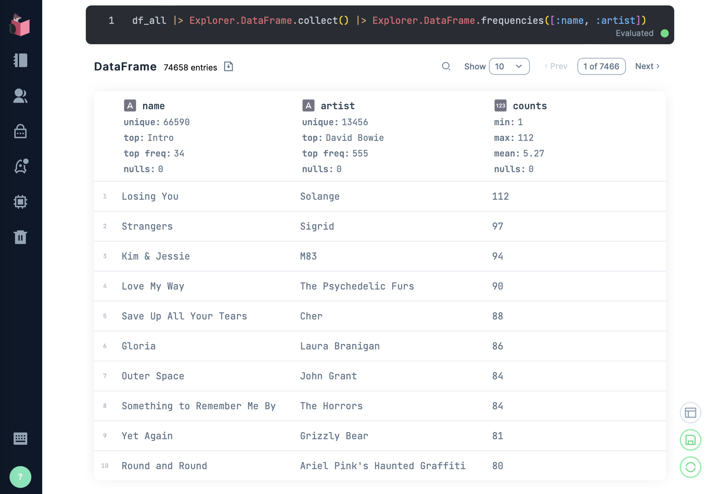

# Lastfm Archive [](https://github.com/boonious/lastfm_archive/actions/workflows/elixir.yml) [](https://hex.pm/packages/lastfm_archive) [](https://coveralls.io/github/boonious/lastfm_archive?branch=master)

A tool for extracting and archiving Last.fm music listening data - [scrobbles](https://www.last.fm/about/trackmymusic).

**Note**: previous analytics features have been migrated to [coda](https://github.com/boonious/coda).
This includes the [on this day Livebook](https://github.com/boonious/coda#livebook-analytics).
Please check out [coda](https://github.com/boonious/coda) for more Last.fm listening data analytics
in the future.

## Usage

Download and create a file archive of Lastfm scrobble tracks via an [Elixir](https://elixir-lang.org)
application or [interactive Elixir](https://elixir-lang.org/getting-started/introduction.html#interactive-mode)
by invoking `iex -S mix` command line action while in software home directory. 
 
```elixir
  # archive all data of a default user specified in configuration
  LastfmArchive.sync # subsequent calls download only latest scrobbles

  # archive all data of any Lastfm user
  # the data is stored in directory named after the user
  LastfmArchive.sync("a_lastfm_user")
```

You can also deploy and use the tool in [Livebook](https://livebook.dev), check out:
- [Guides for archiving and data transforms](#livebook-guides) 

Scrobbles are downloaded via the Last.fm API and stored in the file archive on demand
and on a daily basis. The software has a built-in cache to remember 
and resume from the previous downloads. It skips already downloaded scrobbles and
does not make further requests to the API.

The stored data is in a raw Last.fm `recenttracks` JSON format,
chunked into 200-track (max) `gzip` compressed pages and stored within directories
corresponding to the days when tracks were scrobbled. The file archive in a main 
directory specified in configuration - see below.

### Transform into columnar storage formats
You can transform the file archive into other common storage formats such as CSV and 
columnar data structure such as [Apache Parquet](https://parquet.apache.org). 
These formats facilitate data interoperability, as well as 
[OLAP](https://www.snowflake.com/guides/olap-vs-oltp), analytics use cases.

```elixir
# transform the file archive into columnar Apache Parquet files
LastfmArchive.transform("a_lastfm_user", format: :parquet)

# to columnar Apache Arrow IPC files
LastfmArchive.transform("a_lastfm_user", format: :ipc_stream)

# CSV format also available
LastfmArchive.transform("a_lastfm_user", format: :csv)
```

Available formats: 
- CSV (tab-delimited)
- [Apache Arrow](https://arrow.apache.org) columnar format
- [Apache Parquet](https://parquet.apache.org) columnar format

See [`transform/2`](https://hexdocs.pm/lastfm_archive/LastfmArchive.html#transform/2).

### Read archive

The tool provides a [`read/2`](https://hexdocs.pm/lastfm_archive/LastfmArchive.html#read/2)
function for retrieving data from the archive. It mainly relies on
[Elixir Explorer](https://github.com/elixir-explorer/explorer) data frame mechanisms
to underpin further data i/o, manipulation, analytics and visualisation.

The function returns a lazy `t:Explorer.DataFrame.t/0`.

#### From raw data file archive

Scrobbles stored in the file archive can be read 
with a `day` or `month` option:

```elixir
# read a single-day scrobbles for the configured default user
LastfmArchive.read(day: ~D[2022-12-31])

# read a single-month scrobbles for a user with an arbitrary day of a month
LastfmArchive.read("a_lastfm_user",  month: ~D[2022-12-01])
```

#### From columnar archive for analytics

More data can be loaded from existing columnar archive.
[`read/2`](https://hexdocs.pm/lastfm_archive/LastfmArchive.html#read/2) can be used to
return a single-year or all scrobbles, i.e. **the entire dataset**.
A `columns` option is available to retrieve only a column subset.

```elixir
# load all 2023 data from a Parquet archive
LastfmArchive.read("a_lastfm_user", format: :parquet, year: 2023)

# load all data from an Arrow IPC archive
LastfmArchive.read("a_lastfm_user", format: :ipc_stream)

# load data from specific columns
LastfmArchive.read("a_lastfm_user", format: :parquet, columns: [:id, :artist, :album])
```

See [`read/2`](https://hexdocs.pm/lastfm_archive/LastfmArchive.html#read/2).

## Livebook guides

`LastfmArchive` also provides the following [Livebook](https://livebook.dev) interactive and step-by-step guides: 
  - [Creating a file archive](https://hexdocs.pm/lastfm_archive/archiving.html) guide for creating a local file archive consisting data fetched from the Last.fm API. It provides a heatmap and count visualisation for checking ongoing archiving status.

    [](https://livebook.dev/run?url=https%3A%2F%2Fraw.githubusercontent.com%2Fboonious%2Flastfm_archive%2Fmaster%2Flivebook%2Fguides%2Farchiving.livemd)

    
  - [Columnar data transforms](https://hexdocs.pm/lastfm_archive/transforming.html) guide for transforming the local file archive to columnar data formats (Arrow, Parquet). It demonstrates how `read/2` can be used to load single-year single-column data, as well as an entire dataset into data frame for various analytics. 

    [](https://livebook.dev/run?url=https%3A%2F%2Fraw.githubusercontent.com%2Fboonious%2Flastfm_archive%2Fmaster%2Flivebook%2Fguides%2Ftransforming.livemd)

       
 
## Other usage
To load all transformed CSV data from the archive into Solr:


```elixir
  # define a Solr endpoint with %Hui.URL{} struct
  headers = [{"Content-type", "application/json"}]
  url = %Hui.URL{url: "http://localhost:8983/solr/lastfm_archive", handler: "update", headers: headers}

  LastfmArchive.load_archive("a_lastfm_user", url)
```

The function finds CSV files from the archive and send them to
Solr for ingestion one at a time. It uses `Hui` client to interact
with Solr and the `t:Hui.URL.t/0` struct for Solr endpoint specification.

## Requirement

This tool requires Elixir and Erlang, see [installation](https://elixir-lang.org/install.html) details
for various operating systems or [Livebook](https://livebook.dev).

## Installation

`lastfm_archive` is [available in Hex](https://hex.pm/packages/lastfm_archive),
the package can be installed by adding `lastfm_archive`
to your list of dependencies in `mix.exs`:

```elixir
  def deps do
    [
      {:lastfm_archive, "~> 1.0"}
    ]
  end
```

Documentation can be found at [https://hexdocs.pm/lastfm_archive](https://hexdocs.pm/lastfm_archive).

## Configuration
Add the following entries in your config - `config/config.exs`. For example,
the following specifies an Lastfm `user` and a main file location for
multiple user archives, `./lastfm_data/` relative to the software home directory.

You also need to specify an `lastfm_api_key` in the config, so that the application can
[access Lastfm API](https://www.last.fm/api/authentication).

```elixir
  config :lastfm_archive,
    user: "default_user", # the default user
    data_dir: "./lastfm_data/", # main directory for multiple archives
    lastfm_api_key: "api_key_provided_by_lastfm",
    per_page: 200, # 200 is max no. of tracks per call permitted by Lastfm API 
    interval: 1000 # milliseconds between requests cf. Lastfm's max 5 reqs/s rate limit


  # optional: Solr endpoint for Lastfm data loading
  config :hui, :lastfm_archive,
    url: "http://localhost:8983/solr/lastfm_archive",
    handler: "update",
    headers: [{"Content-type", "application/json"}]

```

See [`sync/2`](https://hexdocs.pm/lastfm_archive/LastfmArchive.html#sync/2)
for other configurable archiving options, e.g. `interval`, `per_page`.

See [`Hui`](https://hexdocs.pm/hui/readme.html#content) for more details on Solr configuration.

An `api_key` must be configured to enable Lastfm API requests,
see [https://www.last.fm/api](https://www.last.fm/api) ("Get an API account").


