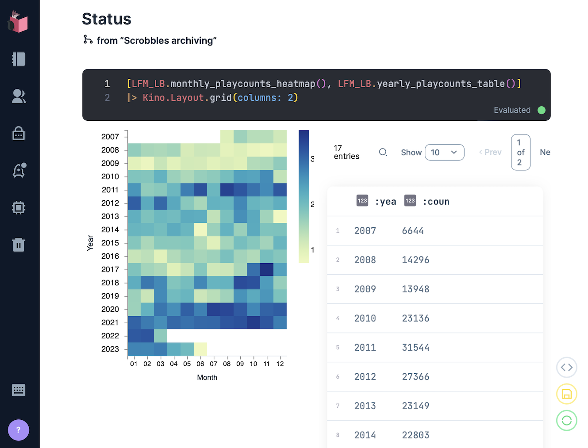

# Lastfm Archive [](https://github.com/boonious/lastfm_archive/actions/workflows/elixir.yml) [](https://hex.pm/packages/lastfm_archive) [](https://coveralls.io/github/boonious/lastfm_archive?branch=master)

A tool for creating local Last.fm scrobble file archive and analytics.

The software is currently experimental and in preliminary development. It should
eventually provide capability to perform ETL and analytic tasks on Lastfm scrobble data.

## Current Usage

Download and create a file archive of Lastfm scrobble tracks via an [Elixir](https://elixir-lang.org)
application or [interactive Elixir](https://elixir-lang.org/getting-started/introduction.html#interactive-mode)
by invoking `iex -S mix` command line action while in software home directory.
 
```elixir
  # archive all data of a default user specified in configuration
  LastfmArchive.sync # subsequent calls download only latest scrobbles

  # archive all data of any Lastfm user
  # the data is stored in directory named after the user
  LastfmArchive.sync("a_lastfm_user")
```

Scrobbles are extracted and stored in the file archive on a daily basis (granularity).
The software has a built-in cache to remember and resume from the previous
downloads. It skips already downloaded scrobbles and does not make further 
requests to Last.fm API.

The data is currently in raw Lastfm `recenttracks` JSON format,
chunked into 200-track (max) `gzip` compressed pages and stored within directories
corresponding to the days when tracks were scrobbled. The file archive in a main 
directory specified in configuration - see below.

## Livebook Support

`LastfmArchive` supports the use of [Livebook](https://livebook.dev) interactive notebook 
for running archiving jobs, visualising archived data and analytics (forthcoming).



Usage:
- [install](https://livebook.dev/#install) the interactive notebooks app
- start the app in a browser
- open the [archiving notebook](livebook/archiving.livemd) 
- follow the configuration steps
- execute / evaluate code blocks to initiate archiving
- visualise archiving progress via playcount heatmap and table

## Other Usage
To generate a TSV file archive from downloaded data:

```elixir
  # transform all existing data in a file archive into TSV files
  LastfmArchive.transform_archive("a_lastfm_user")
```

See [`transform_archive/2`](https://hexdocs.pm/lastfm_archive/LastfmArchive.html#transform_archive/2).


To load all transformed TSV data from the archive into Solr:


```elixir
  # define a Solr endpoint with %Hui.URL{} struct
  headers = [{"Content-type", "application/json"}]
  url = %Hui.URL{url: "http://localhost:8983/solr/lastfm_archive", handler: "update", headers: headers}

  LastfmArchive.load_archive("a_lastfm_user", url)
```

The function finds TSV files from the archive and send them to
Solr for ingestion one at a time. It uses `Hui` client to interact
with Solr and the `t:Hui.URL.t/0` struct for Solr endpoint specification.

## Requirement

This tool requires Elixir and Erlang, see [installation](https://elixir-lang.org/install.html) details
for various operating systems.

## Installation

`lastfm_archive` is [available in Hex](https://hex.pm/packages/lastfm_archive),
the package can be installed by adding `lastfm_archive`
to your list of dependencies in `mix.exs`:

```elixir
  def deps do
    [
      {:lastfm_archive, "~> 0.10"}
    ]
  end
```

Documentation can be found at [https://hexdocs.pm/lastfm_archive](https://hexdocs.pm/lastfm_archive).

## Configuration
Add the following entries in your config - `config/config.exs`. For example,
the following specifies a `default_user` and a main file location for
multiple user archives, `./lastfm_data/` relative to the software home directory.

You also need to specify an `api-key` in the config, so that the application can
[access Lastfm API](https://www.last.fm/api/authentication).

```elixir
  config :lastfm_archive,
    api: %{api_key: "api-key", endpoint: "http://ws.audioscrobbler.com/", method: ""},
    user: "default_user", # the default user
    data_dir: "./lastfm_data/", # main directory for multiple archives
    per_page: 200, # 200 is max no. of tracks per call permitted by Lastfm API 
    interval: 1000 # milliseconds between requests cf. Lastfm's max 5 reqs/s rate limit


  # optional: Solr endpoint for Lastfm data loading
  config :hui, :lastfm_archive,
    url: "http://localhost:8983/solr/lastfm_archive",
    handler: "update",
    headers: [{"Content-type", "application/json"}]

```

See [`sync/2`](https://hexdocs.pm/lastfm_archive/LastfmArchive.html#sync/2)
for other configurable archiving options, e.g. `interval`, `per_page`.

See [`Hui`](https://hexdocs.pm/hui/readme.html#content) for more details on Solr configuration.

An `api_key` must be configured to enable Lastfm API requests,
see [https://www.last.fm/api](https://www.last.fm/api) ("Get an API account").


